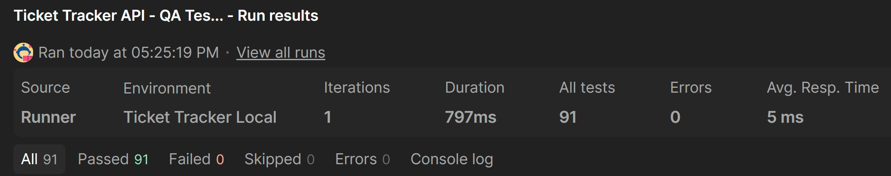
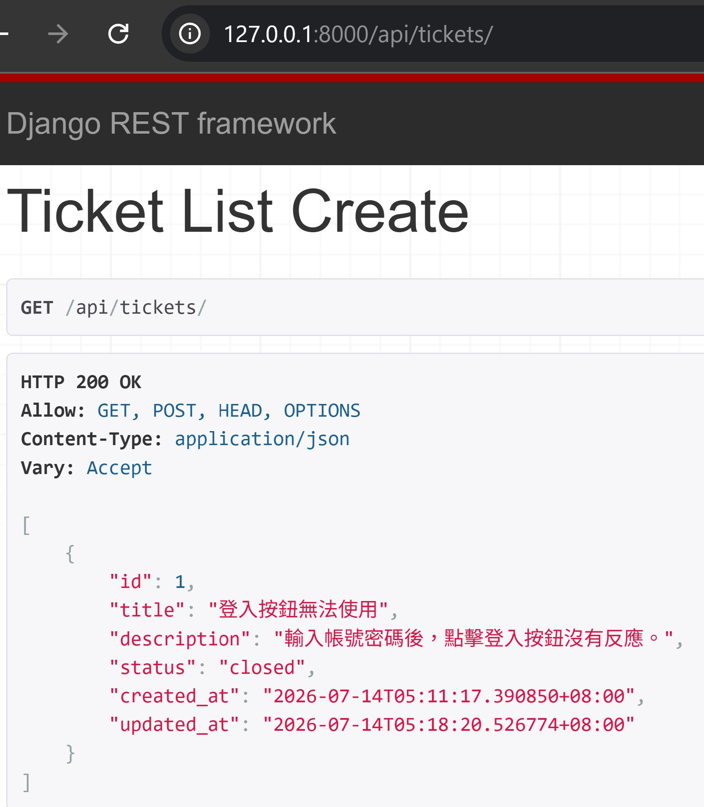
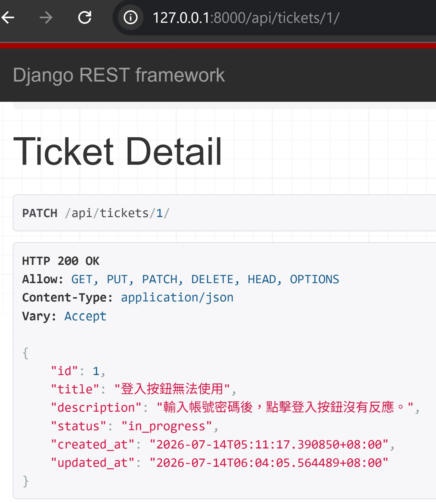

# Ticket Tracker API

使用 Django REST Framework 與 SQLite 開發的 Ticket 管理 API，可新增、查詢、修改及刪除問題單。

## 功能

- 新增 Ticket
- 查詢全部 Ticket
- 查詢單一 Ticket
- 完整或部分修改 Ticket
- 刪除 Ticket
- Ticket 狀態管理：Open、In Progress、Closed

## 技術

- Python
- Django
- Django REST Framework
- SQLite

## API Endpoints

| Method | Endpoint | 功能 |
|---|---|---|
| GET | `/api/tickets/` | 查詢全部 Ticket |
| POST | `/api/tickets/` | 新增 Ticket |
| GET | `/api/tickets/<id>/` | 查詢單一 Ticket |
| PUT | `/api/tickets/<id>/` | 完整修改 Ticket |
| PATCH | `/api/tickets/<id>/` | 部分修改 Ticket |
| DELETE | `/api/tickets/<id>/` | 刪除 Ticket |

## Postman API 測試

使用 Postman Collection 測試 Ticket API 的 CRUD 流程、輸入驗證、邊界條件與測試資料清理。

### 測試範圍

- Ticket CRUD 完整流程
- 必填欄位缺失、空字串、空白字元與 `null`
- 有效與無效的 Ticket status
- `title` 最大長度 200 字元的邊界測試
- 省略 `status` 時使用預設值 `open`
- 空白及省略 `description` 的行為
- 成功建立測試資料後自動執行 Cleanup

### Collection Runner 結果

- Requests：24
- Postman Tests Passed：91
- Failed：0
- Errors：0
- Iterations：1
- Test Cases：24
- Test Case 文件：[docs/test-cases.xlsx](docs/test-cases.xlsx)

Runner 執行完成後，再次查詢 Ticket 清單，確認沒有留下本次測試建立的資料。



### Postman 檔案

- Collection：`postman/Ticket Tracker API - QA Testing.postman_collection.json`
- Environment：`postman/Ticket Tracker Local.postman_environment.json`

### 執行方式

1. 啟動 Django development server。
2. 將 Collection 與 Environment JSON 匯入 Postman。
3. 選擇 `Ticket Tracker Local` Environment。
4. 使用 Collection Runner 執行全部 Requests，Iterations 設為 `1`。

## 安裝與執行

```bash
python -m venv .venv
.venv\Scripts\Activate.ps1
python -m pip install -r requirements.txt
python manage.py migrate
python manage.py runserver
```

啟動後開啟：

`http://127.0.0.1:8000/api/tickets/`

## API 操作畫面

### 查詢 Ticket 清單

`GET /api/tickets/`



### 修改 Ticket 狀態

`PATCH /api/tickets/1/`

```json
{
  "status": "in_progress"
}
```

